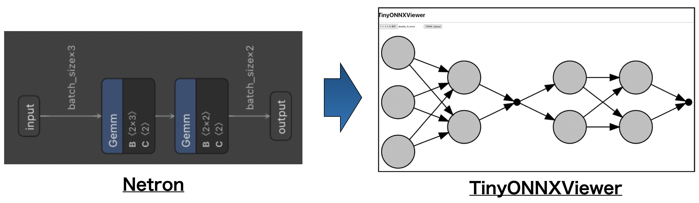

# Release tinyonnxviewer v1.0

Link : https://tinyonnxviewer.com

Web application for demonstration purposes that draws mainly "tiny" ONNX files with high accuracy. The difference from `Netron` (which is a famoust tool that can draw `*.onnx` file beautifully) is that this rendering is not layer by layer but unit by unit, which enables visualization of more detailed information. For a general size of neural networks (like ResNet, AlexNet etc..) of 10 or more layers, drawing is done layer by layer (and in this case, drawing is not at all beautiful).

# Usage
Press the file selection button at the bottom of the UI to select an ONNX file, then press the `ONNX Upload` button to draw the uploaded ONNX file. non-ONNX files are not supported.

# citation
netron : https://netron.app/
